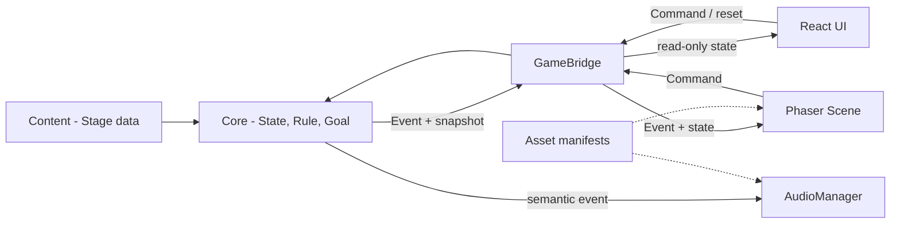

# 아키텍처

## 구성 요소와 상태 소유권

Core의 `PuzzleEngine`만 가변 월드 상태와 시뮬레이션 시간을 소유합니다. 외부에는 매번 복제한
읽기 전용 형태를 제공합니다. Content는 초기 상태, 활성 Rule ID, Goal과 에셋 논리 키를 선언합니다.
Bridge는 Command 전달, Event 구독, snapshot 조회, reset과 정리를 제공합니다.

React는 미션/힌트/버튼/진행률을 렌더링하고 Phaser 캔버스를 마운트합니다. Phaser는 도형과 텍스트,
드래그 입력, Tween만 담당합니다. Audio는 Core Event를 의미 기반 SoundEvent로 매핑할 수 있는
별도 포트이며 파일이 없으면 재생을 생략합니다.

## Command와 Event 흐름

물병 드래그 중 좌표는 Phaser View에만 임시 반영됩니다. 드래그가 끝나면 Phaser가 책상 표시 영역을
위치 ID로 번역해 `MOVE_OBJECT`를 보냅니다. Core는 ID와 조작 가능 여부를 검사하고 상태를 바꾼 뒤
`OBJECT_MOVED`, `OBJECT_PLACED`, 필요 시 `ACTOR_SPOTTED_OBJECT`, Goal Event와 `STATE_CHANGED`를 냅니다.
Bridge가 최신 snapshot을 보관하고 React의 `useSyncExternalStore` 및 Phaser Event 구독자에게 전달합니다.

`ADVANCE_TIME`도 Core Command라 안정성 판정은 프레임 속도나 UI 타이머에 종속되지 않습니다.
재시작은 Bridge가 Core reset을 호출하며 초기 Stage 데이터로 완전히 재생성합니다.

## 렌더링과 규칙 분리

고양이 관심 조건은 `core/rules/catInterestRule.ts`, 안정성은 `core/goals`에 있습니다. `RoomScene`은
Event에 Tween을 붙일 뿐 조건을 재판정하지 않습니다. 향후 “고양이 접근 → 물병 낙하”는 Core의
지연 행동과 상태 변경 Event로 구현하며 Scene은 접근/낙하 애니메이션만 재생합니다.

React StrictMode의 effect 재실행 시 각 `PhaserGame` cleanup이 캔버스를 파괴합니다. Bridge 정리는
microtask까지 미루고 effect 세대를 비교해 즉시 재마운트된 인스턴스의 조기 폐기를 막습니다.
Bridge는 중복 destroy를 허용하고 모든 구독 해제 함수를 제공하며 `window` 전역을 사용하지 않습니다.
