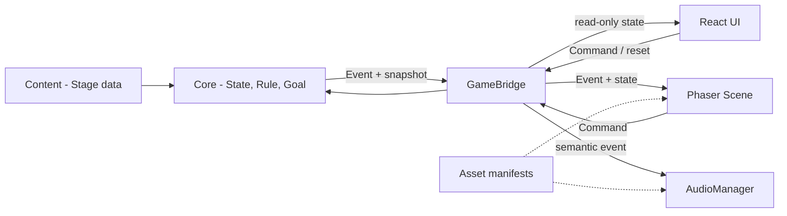

# 아키텍처

## 구성 요소와 상태 소유권

Core의 `PuzzleEngine`만 가변 월드 상태와 시뮬레이션 시간을 소유합니다. 외부에는 매번 복제한
읽기 전용 형태를 제공합니다. Content는 초기 상태, 활성 Rule ID, Goal과 에셋 논리 키를 선언합니다.
Bridge는 Command 전달, Event 구독, snapshot 조회, reset과 정리를 제공합니다.

React는 미션/버튼/진행률/상태/성공 패널을 렌더링하고 Phaser 캔버스를 마운트합니다. Phaser는 SVG,
방의 단순 Graphics, 드래그 입력과 Tween만 담당합니다. Audio는 Core Event를 의미 기반 SoundEvent로 매핑하는
별도 포트이며 파일이 없으면 재생을 생략합니다. `AudioManager`가 marker/cooldown/loop 정책을 소유하고
`WebAudioPlaybackBackend`는 unlock, decode, gain과 실제 source 수명만 관리합니다.

## Command와 Event 흐름

오브젝트 드래그 중 좌표는 Phaser View에만 임시 반영됩니다. 시작 시 `PICK_UP_OBJECT`, 완료 시 Phaser가
좌표를 Stage 데이터의 zone ID로 번역해 `DROP_OBJECT`를 보냅니다. Core는 ID, zone, 입력 잠금을 검사하고
`OBJECT_DROPPED`, 고양이 행동 Event, Goal Event와 `STATE_CHANGED`를 냅니다. 유효하지 않은 드롭은
`CANCEL_DRAG`로 원상 복구됩니다.
유효 영역 밖 드롭은 상태를 바꾸지 않는 `OBJECT_DROP_REJECTED` 표현 Event도 발생시켜 UI 사운드에
연결합니다. 착지와 물웅덩이 생성도 각각 `CAT_LANDED`, `WATER_SPILLED`로 한 번만 발행됩니다.
Bridge가 최신 snapshot을 보관하고 React의 `useSyncExternalStore` 및 Phaser Event 구독자에게 전달합니다.

`ADVANCE_TIME`도 Core Command라 안정성 판정은 프레임 속도나 UI 타이머에 종속되지 않습니다.
재시작은 `RESET_STAGE` Command로 초기 Stage 데이터와 시뮬레이션 시간을 완전히 재생성합니다.

## 렌더링과 규칙 분리

Stage 1의 규칙과 고양이 상태 전이는 `core/rules/StageOneRuleSystem.ts`, Stage 2의 선풍기·서류 규칙은
`core/rules/StageTwoRuleSystem.ts`에 독립적으로 위치합니다. `PuzzleEngine`은 Stage의 활성 Rule ID로
한 시스템만 선택하므로 Stage 2 규칙이 Stage 1 고양이 상태 머신에 섞이지 않습니다. 안정성 조건은 `core/goals`에
있습니다. Rule System은 다음 행동 경계까지 시간을 잘라 처리하므로 큰 tick과 작은 tick의 최종 결과가
같습니다. `RoomScene`과 `CatView`는 Event/상태에 Tween을 붙일 뿐 조건을 재판정하지 않습니다.

고양이는 `idle → noticing-bottle → preparing-jump → jumping → tapping-bottle → returning` 순서로
공격합니다. 간식과 장난감은 notice/prepare 단계에서 공격을 취소하며 jump/tap 단계에서는 현재 공격 뒤
예약됩니다. 매트는 고양이 공격을 막지 않고 물병의 최종 방향을 `upright`로 유지합니다. 성공은 Core의
가상 시간으로 3초간 목표 상태가 유지될 때 한 번만 확정됩니다.

`PreloadScene`은 작은 Asset Manifest를 통해 SVG를 권장 표시 크기의 2배 해상도로 래스터화합니다.
`CatView`는 `cat-rig.json`의 레이어와 피벗을 읽어 back-leg, tail, body, front-leg, head, face를 조립하며,
표정 교체와 회전/압축/이동 애니메이션은 Core 고양이 상태의 시각적 표현입니다.

React StrictMode의 effect 재실행 시 각 `PhaserGame` cleanup이 캔버스를 파괴합니다. Bridge 정리는
microtask까지 미루고 effect 세대를 비교해 즉시 재마운트된 인스턴스의 조기 폐기를 막습니다.
Bridge는 중복 destroy를 허용하고 모든 구독 해제 함수를 제공하며 `window` 전역을 사용하지 않습니다.
Scene shutdown과 Bridge destroy는 활성 행동 loop를 정리하고, reset은 loop/cooldown/Stage당 1회 기록을
초기화합니다. 브라우저 오디오는 최초 사용자 입력에서만 unlock되며 Core 가상 시간과 독립적입니다.

Stage 전환은 React가 Stage별 `GameBridge`와 Phaser lifecycle을 교체하는 방식입니다. 기존 Scene과 Bridge를
먼저 정리한 뒤 같은 host에 다음 Stage canvas를 마운트하므로 동시에 두 canvas가 존재하지 않습니다.
Stage 2의 `FanView`와 `PaperView`는 snapshot의 논리 상태를 피벗·Tween으로 표현하며 blade 회전 각도처럼
퍼즐 결과와 무관한 값만 Phaser가 소유합니다.
